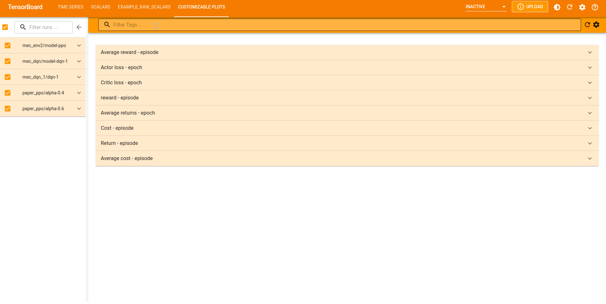

# Customizable Plots - Tensorboard Plugin

This plugin is a simple Tensorboard dashboard to visualize, customize 
and export ready-to-use scalar plots.

_Based on [plotly.js](https://github.com/plotly/plotly.js/),
[react](https://github.com/facebook/react) and [material-ui](https://github.com/mui/material-ui)._


## Installation
```bash
pip install tensorboard-plugin-customizable-plots
```
After running Tensorboard, a new tab labeled `CUSTMOZIABLE PLOTS` will be added to the Tensorboard dashboard.

## Features
The plugin has almost the same features as the `TIME SERIES` or the `SCALARS` dashboards, 
plus [plotly.js](https://github.com/plotly/plotly.js/) features:

* The ability to customize the plot title and the axis labels.
* The ability to customize the colors. 
* Legends are attached with each plot.
* X-axis and Y-axis both support `log` scale.
* The customized plots can be exported to many image formats including `svg` and `png`.

_Check [plotly.js documentation](https://plotly.com/javascript/reference/) 
for the full list of features and options._

## Limitations

* Not as good and stylish as the `TIME SERIES` plugin. 
* Somehow slow  :(
* The settings with a text field are not applied until `Enter` is pressed (I tried to implement `onChange` but it makes the plugin slower)

_So until the Tensorboard authors implement the above features, 
one might use the `TIME SERIES` 
dashboard to track the progress of the plots (as it is more responsive)
and use this plugin to customize and export them._ 
## license
The plugin is licensed under the Apache License, Version 2.0. See `LICENSE` for the full license text.